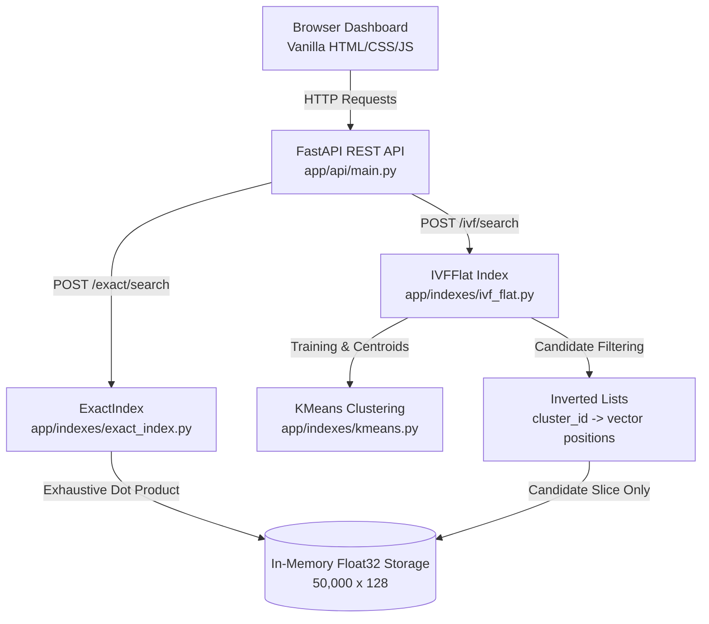

# Vector Database From Scratch

A lightweight, educational vector database implemented from first principles using Python and NumPy. It provides exact brute-force cosine-similarity search and an IVF-Flat (Inverted File with Flat vectors) approximate nearest-neighbor index, exposed through a FastAPI REST API and an interactive browser dashboard.

> **Note**: This project is built from scratch for educational purposes and coding-round demonstrations. It does not use FAISS, Chroma, Pinecone, Annoy, hnswlib, or any external vector search libraries.

---

## 1. Features

- **Exact Search**: Brute-force cosine similarity using NumPy matrix multiplication.
- **K-Means From Scratch**: High-dimensional vector space partitioning with vectorized Euclidean distance expansion.
- **IVF-Flat Index**: Approximate nearest-neighbor search restricting similarity evaluation to candidate Voronoi cells.
- **Configurable `nprobe`**: Tune the recall versus latency trade-off.
- **Top-k Search**: Efficient partial selection with `np.argpartition`.
- **Dynamic Insert & Delete**: Add and remove vectors while maintaining inverted list synchronization.
- **FastAPI REST API**: Endpoints for index stats, search, insert, and delete operations.
- **Interactive Browser Dashboard**: Single-page vanilla HTML/CSS/JS interface for real-time query comparisons.
- **Comprehensive Evaluation Suite**: 10,000-query benchmark across multiple query distributions, mutation tests, and edge cases.

---

## 2. Architecture



### Data Flow

#### Exact Search Flow
```
Query Vector 
  → Normalize to unit length
  → Matrix multiplication against all 50,000 stored vectors (vectors @ q)
  → Cosine similarity scores
  → Top-k selection via argpartition
```

#### IVF-Flat Approximate Search Flow
```
Query Vector 
  → Normalize to unit length
  → Compute Euclidean distance to all 100 cluster centroids
  → Select nprobe nearest clusters
  → Gather candidate vector positions from selected inverted lists
  → Compute exact cosine similarity ONLY against candidate vectors
  → Top-k selection via argpartition
```

> **Important**: IVF-Flat does **not** approximate the final similarity arithmetic. The approximation comes solely from restricting the search space to vectors in the selected `nprobe` Voronoi cells.

---

## 3. Dataset

The project includes a synthetic clustered vector dataset generated for controlled benchmarking:

- **Vector Count**: 50,000 vectors
- **Dimensionality**: 128 dimensions
- **Underlying Clusters**: 100 source clusters (500 vectors per cluster with Gaussian noise $\sigma = 0.1$)
- **Data Type**: `float32` (IEEE 754 single-precision)
- **Normalization**: Unit L2 normalized ($\|v\|_2 = 1.0$)
- **IDs**: Contiguous integers `0` through `49,999`
- **Random Seed**: Fixed seed `42` for deterministic reproducibility

### Why Synthetic Clustered Data?
Synthetic vectors allow reproducible, self-contained experiments with controlled cluster density and measurable recall behavior without requiring external embedding APIs or proprietary datasets.

---

## 4. Exact Search (`ExactIndex`)

`ExactIndex` performs exhaustive brute-force cosine similarity search across all stored vectors.

- **Similarity Metric**: Because stored vectors and queries are normalized to unit length, cosine similarity equals the dot product:
  $$\text{sim}(u, v) = u \cdot v = \sum_{i=1}^D u_i v_i$$
- **Vectorization**: Uses BLAS-accelerated NumPy matrix-vector multiplication (`self._vectors @ q`).
- **Complexity**: $O(N \cdot D)$ per query, where $N = 50,000$ and $D = 128$.
- **Ground Truth**: ExactIndex serves as the 100% recall baseline for all approximate search evaluations.

---

## 5. K-Means Clustering (`KMeans`)

The `KMeans` class partitions the 128-dimensional vector space into Voronoi cells:

1. **Centroid Initialization**: Randomly samples $K$ distinct vectors from the dataset.
2. **Vectorized Assignment**: Computes squared Euclidean distances using matrix expansion:
   $$\|x - c\|^2 = \|x\|^2 + \|c\|^2 - 2(x \cdot c^T)$$
3. **Centroid Update**: Recomputes centroids as the arithmetic mean of assigned vectors.
4. **Empty Cluster Recovery**: Reassigns empty cluster centroids to random dataset samples.
5. **Termination**: Stops when cluster assignments stabilize or when reaching `max_iterations = 20`.

### Observed Cluster Distribution (100 Clusters, 50,000 Vectors)

| Metric | Value |
| :--- | :--- |
| **Minimum Cluster Size** | 1 vector |
| **P25 Cluster Size** | 272 vectors |
| **Median Cluster Size** | 500 vectors |
| **Mean Cluster Size** | 500.0 vectors |
| **P75 Cluster Size** | 500 vectors |
| **P90 Cluster Size** | 1,000 vectors |
| **Maximum Cluster Size** | 2,000 vectors |
| **Standard Deviation** | 346.49 vectors |
| **Empty Clusters** | 0 |

> **Note**: Standard K-Means minimizes inertia rather than enforcing equal cluster sizes. This natural imbalance causes candidate counts to vary depending on which clusters a query falls into.

---

## 6. IVF-Flat Index (`IVFFlat`)

`IVFFlat` indexes vectors into an inverted file structure:
- **Index Structure**: `_inverted_lists[cluster_id] = list[int]` stores row positions in the contiguous vector array.
- **Query Resolution**: Only candidate vectors from the `nprobe` nearest centroid lists are evaluated.

### `nprobe` Parameter Trade-off
- **Low `nprobe` (e.g., 1–2)**: Searches fewer candidate vectors, delivers low latency and high QPS with modest recall.
- **Higher `nprobe` (e.g., 5–20)**: Inspects more Voronoi partitions, pushing Recall@10 toward 100% at the cost of higher latency.
- **Exhaustive Probe (`nprobe = 100`)**: Evaluates all 100 inverted lists (the entire 50,000-vector dataset), matching exact search.

---

## 7. Exact Search vs. IVF-Flat Comparison

| Property | ExactIndex | IVFFlat |
| :--- | :--- | :--- |
| **Search Paradigm** | Exhaustive Brute-Force | Approximate Nearest Neighbor (ANN) |
| **Search Space** | All $N$ vectors ($50,000$) | Candidate vectors in `nprobe` clusters |
| **Accuracy** | Exact (100% Recall Ground Truth) | Approximate (Governed by `nprobe`) |
| **Index Training** | None ($O(1)$ build) | K-Means training ($O(I \cdot N \cdot K \cdot D)$) |
| **Tuning Parameter** | None | `nprobe` (1 to $K$) |
| **Candidate Count** | Fixed ($50,000$) | Variable ($\approx \frac{\text{nprobe}}{K} \times N$) |
| **Best Use Case** | Small datasets ($N < 50\text{K}$) / strict precision | Large datasets ($N \gg 100\text{K}$) / latency-critical |

---

## 8. Benchmark Results

Measured on 10,000 reproducible benchmark queries (`scripts/evaluate_vector_db.py`):

### Exact Search Baseline ($k=10$)
- **Average Latency**: `3.18 ms`
- **P50 Latency**: `2.41 ms`
- **P95 Latency**: `7.31 ms`
- **P99 Latency**: `10.36 ms`
- **Throughput**: `314.0 QPS`

### IVF-Flat Search ($k=10$, Varying `nprobe`)

| `nprobe` | Avg Candidates | Candidate Reduction | Avg Latency | P50 Latency | P95 Latency | P99 Latency | Recall@10 | Speedup vs Exact |
| :---: | :---: | :---: | :---: | :---: | :---: | :---: | :---: |
| **1** | 727.8 | **98.54%** | **0.41 ms** | 0.21 ms | 1.11 ms | 3.95 ms | **95.31%** | **7.85×** |
| **2** | 2,090.6 | **95.82%** | **1.58 ms** | 1.27 ms | 5.17 ms | 8.53 ms | **99.19%** | **2.02×** |
| **5** | 5,988.9 | **88.02%** | **5.24 ms** | 4.41 ms | 10.32 ms | 14.28 ms | **100.00%** | **0.61×** |
| **10** | 11,344.5 | **77.31%** | **6.47 ms** | 5.57 ms | 11.32 ms | 15.56 ms | **100.00%** | **0.49×** |
| **20** | 18,894.9 | **62.21%** | **9.55 ms** | 9.25 ms | 13.66 ms | 17.35 ms | **100.00%** | **0.33×** |
| **50** | 31,230.5 | **37.54%** | **16.97 ms** | 15.83 ms | 25.27 ms | 38.33 ms | **100.00%** | **0.19×** |
| **100** | 50,000.0 | **0.00%** | **25.35 ms** | 24.51 ms | 36.49 ms | 49.13 ms | **100.00%** | **0.13×** |

> **Disclaimer**: Latency measurements depend on CPU architecture, cache locality, and runtime environment. These results demonstrate algorithmic scaling trade-offs rather than absolute hardware guarantees.

---

## 9. Query Distribution Evaluation

Evaluated across 1,000 queries per category:

| Query Category | `nprobe` | Recall@10 | Avg Latency | QPS |
| :--- | :---: | :---: | :---: | :---: |
| **A. Existing Dataset Vectors** | 1 | **95.47%** | 0.30 ms | 3,313.2 |
| | 5 | **100.00%** | 3.37 ms | 297.1 |
| **B. Perturbed ($\sigma = 0.001$)** | 1 | **94.63%** | 0.39 ms | 2,546.7 |
| | 5 | **100.00%** | 2.90 ms | 345.1 |
| **B. Perturbed ($\sigma = 0.01$)** | 1 | **95.55%** | 0.33 ms | 3,071.5 |
| | 5 | **100.00%** | 3.17 ms | 315.7 |
| **B. Perturbed ($\sigma = 0.05$)** | 1 | **94.61%** | 0.31 ms | 3,269.3 |
| | 5 | **100.00%** | 3.30 ms | 303.1 |
| **B. Perturbed ($\sigma = 0.1$)** | 1 | **93.18%** | 0.29 ms | 3,471.9 |
| | 5 | **100.00%** | 3.30 ms | 302.8 |
| **C. Uniform Random Unit Vectors** | 1 | **16.30%** | 0.45 ms | 2,211.2 |
| | 5 | **42.11%** | 3.39 ms | 294.6 |
| | 20 | **100.00%** | 8.54 ms | 117.1 |

### Key Takeaway
IVF partitioning assumes clustered data locality. In-distribution queries achieve ~95% recall at `nprobe = 1`, whereas uniformly distributed random queries do not concentrate near centroids and require larger `nprobe` values to achieve equivalent recall.

---

## 10. Performance Interpretation

1. **Optimal Speed / Recall Balance**: At `nprobe = 1`, IVF achieves a **7.85× speedup** (0.41 ms vs. 3.18 ms) with **95.31% Recall@10** while evaluating only 728 candidates on average (**98.54% search space reduction**).
2. **High-Fidelity Setting**: At `nprobe = 2`, IVF achieves **99.19% Recall@10** with a **2.02× speedup** (1.58 ms).
3. **Crossover Phenomenon**: At `nprobe ≥ 5`, candidate gathering and non-contiguous memory slicing in Python introduce overhead that outweighs matrix operation savings on a 50,000-vector dataset. IVF becomes increasingly beneficial as dataset scale $N$ increases.

---

## 11. Build Performance & Memory Footprint

Measured on the 50,000 $\times$ 128 float32 dataset:

- **Dataset File Load**: `30.68 ms`
- **ExactIndex Initialization**: `70.22 ms`
- **IVFFlat K-Means Training & Build**: `3.1313 s`
- **Total Initialization Time**: `3.2322 s`

### Raw Array Memory Allocation
- **Vectors (`float32`)**: `24.41 MB` ($50,000 \times 128 \times 4$ bytes)
- **IDs (`int64`)**: `390.62 KB` ($50,000 \times 8$ bytes)
- **Centroids (`float32`)**: `50.00 KB` ($100 \times 128 \times 4$ bytes)
- **Total Raw Array Footprint**: `24.84 MB`

---

## 12. Dynamic Mutations (Insert & Delete)

| Operation | Batch Size | Latency | Verification Status |
| :--- | :---: | :---: | :---: |
| **Insert 1 vector** | 1 | 20.66 ms | PASSED (Searchable, duplicate ID rejected) |
| **Insert 100 vectors** | 100 | 22.41 ms | PASSED (Searchable, duplicate IDs rejected) |
| **Delete 1 vector** | 1 | 125.80 ms | PASSED (Removed from index, absent in search) |
| **Delete 100 vectors** | 100 | 120.84 ms | PASSED (Removed from index, absent in search) |

> **Deletion Architecture**: To prevent stale index pointers, `delete()` compacts the contiguous vector array and cleanly updates inverted list position indices. Deletion is therefore more computationally expensive than insertion.

---

## 13. REST API Endpoints

The service exposes a FastAPI backend:

| Method | Endpoint | Description |
| :--- | :--- | :--- |
| `GET` | `/` | Serves the interactive browser demo dashboard |
| `GET` | `/health` | Service health status (`{"status": "ok"}`) |
| `GET` | `/stats` | Returns index sizes, dimension, cluster count, default `nprobe` |
| `GET` | `/sample` | Returns a sample 128-D vector from the loaded dataset |
| `POST` | `/exact/search` | Performs exact brute-force cosine similarity search |
| `POST` | `/ivf/search` | Performs IVF approximate search and returns candidate counts |
| `POST` | `/exact/insert` | Inserts a vector into `ExactIndex` |
| `POST` | `/ivf/insert` | Inserts a vector into `IVFFlat` (assigns to closest centroid) |
| `DELETE` | `/exact/delete/{id}`| Deletes a vector by integer ID from `ExactIndex` |
| `DELETE` | `/ivf/delete/{id}`| Deletes a vector by integer ID from `IVFFlat` |

### Example Search Payloads

#### Exact Search Request (`POST /exact/search`)
```json
{
  "vector": [0.0125, -0.0451, 0.0892, 0.0034],
  "k": 10
}
```

#### IVF Search Request (`POST /ivf/search`)
```json
{
  "vector": [0.0125, -0.0451, 0.0892, 0.0034],
  "k": 10,
  "nprobe": 2
}
```

#### IVF Search Response
```json
{
  "results": [
    {"id": 42, "score": 1.000000},
    {"id": 128, "score": 0.988155}
  ],
  "count": 2,
  "nprobe": 2,
  "candidates": 2090
}
```

---

## 14. Interactive Browser Dashboard

The single-page dashboard (`http://127.0.0.1:8000/`) provides:
- Live API connectivity status indicator.
- Dataset statistics (`50,000` vectors, `128` dimensions, `100` clusters).
- Instant sample query generator.
- Configurable top-$k$ ($1$–$50$) and `nprobe` slider ($1$–$100$).
- Comparative execution (`Exact Search`, `IVF Search`, and `⚡ Compare Both`).
- Side-by-side ranked result tables with matching ID highlight indicators.
- Client-observed latency, candidate count, search space reduction, and single-query Recall@k / Speedup metrics.

---

## 15. Screenshots

<!-- Add dashboard screenshot here after capturing the final UI. -->
*Dashboard interface available at `http://127.0.0.1:8000/` when running the application.*

---

## 16. Project Structure

```
vector-db-from-scratch/
├── app/
│   ├── __init__.py
│   ├── api/
│   │   ├── __init__.py
│   │   ├── main.py
│   │   └── static/
│   │       ├── index.html
│   │       ├── style.css
│   │       └── app.js
│   ├── data/
│   │   └── __init__.py
│   ├── indexes/
│   │   ├── __init__.py
│   │   ├── exact_index.py
│   │   ├── kmeans.py
│   │   └── ivf_flat.py
│   └── utils/
│       └── __init__.py
├── data/
│   ├── vectors.npy        # Generated via scripts/generate_data.py
│   ├── ids.npy            # Generated via scripts/generate_data.py
│   └── metadata.json      # Dataset metadata
├── scripts/
│   ├── generate_data.py   # Dataset generator (50K x 128, 100 clusters)
│   ├── benchmark_exact.py # Exact index baseline benchmark
│   ├── benchmark_ivf.py   # IVF vs Exact 500-query benchmark
│   └── evaluate_vector_db.py # 10,000-query evaluation suite
├── tests/
│   ├── test_dataset.py     # Dataset generation tests
│   ├── test_exact_index.py # ExactIndex test suite (10 tests)
│   ├── test_kmeans.py      # KMeans test suite (10 tests)
│   ├── test_ivf_flat.py    # IVFFlat test suite (16 tests)
│   └── test_api.py         # REST API test suite (9 tests)
├── requirements.txt
├── README.md
└── .gitignore
```

---

## 17. Installation & Quickstart

### Prerequisites
- Python 3.11+
- Git

### 1. Clone & Setup Environment
```bash
git clone https://github.com/Khushal-Nikhare/vector-db-from-scratch.git
cd vector-db-from-scratch

# Create and activate virtual environment
python -m venv .venv

# Windows:
.venv\Scripts\activate

# Linux/macOS:
# source .venv/bin/activate
```

### 2. Install Dependencies
```bash
pip install -r requirements.txt
```

### 3. Generate Dataset (If Not Present)
```bash
python scripts/generate_data.py
```

### 4. Run Test Suite
```bash
python -m pytest tests/
```

### 5. Launch API & Dashboard
```bash
uvicorn app.api.main:app --reload
```
Open **`http://127.0.0.1:8000/`** in your browser.

---

## 18. Benchmark & Evaluation Commands

| Command | Purpose |
| :--- | :--- |
| `python scripts/benchmark_exact.py` | Measures latency and QPS for brute-force exact search |
| `python scripts/benchmark_ivf.py` | Compares IVF against exact ground truth across `nprobe` values (500 queries) |
| `python scripts/evaluate_vector_db.py` | Runs 10,000-query comprehensive evaluation with distribution and mutation tests |

---

## 19. Testing

The test suite contains 48 unit and integration tests:

```bash
python -m pytest tests/
```
```
============================= 48 passed in 7.26s =============================
```

- **`test_dataset.py`**: Shape validation, float32 precision, unit normalization, reproducibility.
- **`test_exact_index.py`**: Initialization, top-k ordering, ID correspondence, dot product score correctness, duplicate ID rejection, mutations.
- **`test_kmeans.py`**: Centroid shapes, label assignments, prediction dimensions, reproducibility, error handling.
- **`test_ivf_flat.py`**: Voronoi partitioning, inverted list coverage, candidate-only isolation, variable `nprobe`, mutation synchronization.
- **`test_api.py`**: FastAPI endpoints (`/health`, `/stats`, `/sample`, `/exact/search`, `/ivf/search`, inserts, and deletions).

---

## 20. Design Decisions

- **Why Pure NumPy?** Provides hardware-optimized vectorized arithmetic and BLAS matrix operations with zero third-party vector database dependencies.
- **Why Cosine Similarity via Dot Product?** L2-normalizing vectors upfront allows cosine similarity to be computed as a simple dot product, avoiding repeated runtime square-root calculations.
- **Why IVF-Flat?** Inverted File Indexing represents the foundational ANN architecture, making Voronoi space partitioning and candidate pruning intuitive to analyze.
- **Why Synthetic Clustered Data?** Guarantees zero external network dependencies and repeatable benchmarking conditions.

---

## 21. Limitations

1. **In-Memory Architecture**: Indices and dataset arrays are resident in RAM without disk persistence.
2. **K-Means Rebalancing**: New insertions are assigned to the closest existing centroid without retraining the Voronoi partition.
3. **Deletion Overhead**: Deletion compacts the contiguous array and rebuilds inverted list offsets ($O(N)$), making it slower than insertion.
4. **Dataset Scale Sensitivity**: At $N=50,000$, Python list-gathering overhead makes IVF slower than monolithic matrix multiplication when `nprobe ≥ 5`.
5. **Out-of-Distribution Sensitivity**: Uniform random queries experience lower recall at low `nprobe` due to lack of geometric cluster concentration.

---

## 22. Future Improvements

- **Centroid Initialization**: Implement k-means++ seeding for improved initial centroid dispersion.
- **Tombstone Deletions**: Mark deleted records with tombstones to avoid immediate array compaction.
- **Quantization (IVF-PQ)**: Compress vectors into short byte codes using Product Quantization for reduced memory footprint.
- **Graph-Based Indexing**: Implement HNSW (Hierarchical Navigable Small World) for higher recall at lower probe overhead.
- **Dynamic Rebalancing**: Schedule background K-Means re-clustering after significant insert/delete mutation volumes.

---

## 23. Technical Takeaways

- **Exact Search is Ground Truth**: Approximate search quality must always be measured relative to exact brute-force recall.
- **ANN Trade-offs**: Pruning the search space with Voronoi cells reduces distance calculations by over 98%, enabling substantial throughput gains at controlled recall levels.
- **Data Geometry Matters**: Approximate indexing performance is intimately tied to underlying cluster distributions; uniform random noise behaves differently from clustered semantic embeddings.
